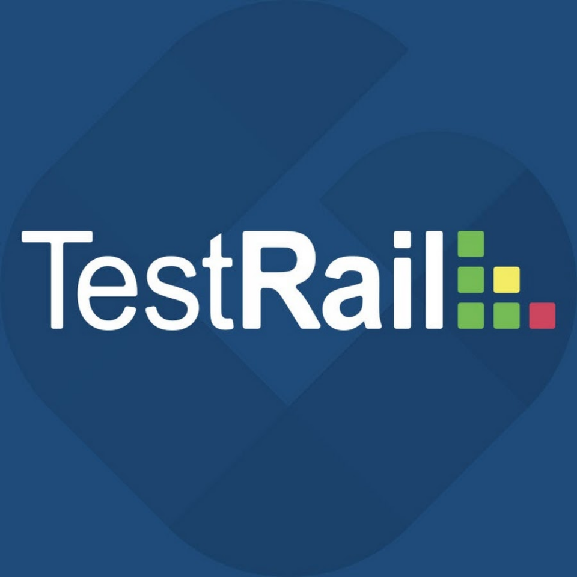

### Всем привет 👋

**Обо мне**

- 💼 Я QA Engineer
- 🌱 Я сейчас работаю в Evotor
- 📫 Мой телеграм: Telegram @Pavel_Korolev_off

**Языки и инструменты:**

<code></code>
<code></code>
<code></code>
<code></code>

# Диплом
<code></code>

В рамках обучения в школе <a href="QA.GURU">QA.GURU</a> была подготовлена выпускная работа.
Работа состоит из трех частей: автоматизация UI, API и Mobile App.

**Проект UI автотестов**
------------------------
<a href="https://github.com/PavelKorolevA/TestWildberries"> Github</a>

<a href="https://jenkins.autotests.cloud/job/pkorolev_diplom/">  Jenkins</a>

<a href="https://jenkins.autotests.cloud/job/pkorolev_diplom/allure/"> Allure TestOps Dashboard</a>

**Проект API автотестов**
------------------------
<a href="https://github.com/PavelKorolevA/rest_api"> Github</a>

<a href="https://jenkins.autotests.cloud/job/pkorolev_diplom_rest_api/"> Jenkins</a>

<a href="https://jenkins.autotests.cloud/job/pkorolev_diplom_rest_api/allure/"> Allure TestOps Dashboard</a>

**Проект Mobile автотестов**
------------------------
<a href="https://github.com/PavelKorolevA/mobile_progect_Wiki"> Github</a>

<a href="https://jenkins.autotests.cloud/job/pkorolev_diplom_mobile/"> Jenkins</a>

<a href="https://jenkins.autotests.cloud/job/pkorolev_diplom_mobile/allure/"> Allure TestOps Dashboard</a>
